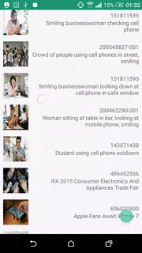

<h1 align="center"> MVP Clean Architecture Example (Dagger2, Retrofit2 ad RxJava2) with Unit and Instrumentation testing</h1>
<i>Under development MVP example using GettyImage API</i>

<h3>Architecture </h3>
<ul>
<li>
MVP (Model View Presenter) based on GoogleSample Android-Architecture (https://github.com/googlesamples/android-architecture)  
</li>
<li>
Reatrolambda with Java8 (They are supported by default on Android Studio 2.4 Preview 4)
</li>
</ul>

<h3>Configs </h3>
<ul>
<li>
MinSdk: <b>15</b>
</li>
<li>
Gradle: <b>2.4.0-alpha4</b>
</li>
</ul>

<h3>Third Party libraries </h3>
<ul>
<li>
Retrofit2 and OkHttp3(For handling HTTP network requests/responses)  
</li>
<li>
Gson (Parsing Json) 
</li>
<li>
RxAndroid, RxJava(For async operations/ reactive programming)  
</li>
<li>
Espresso (Simulating some UI interactions for Instrumentation/Functional/UI tests)  
</li>
<li>
Junit4/JunitRunner (Unit Test runner)  
</li>
<li>
Roboelectric (Unit testing android SDK)
</li>
<li>
Mockito (Mocking objects when unit testing)  
</li>
<li>
Butterknife (Getting rid of boilerplate code)
</li>
<li>
Parceler (Easy Serializing/Deserializing)
</li>
<li>
Glide (Loading and caching images)
</li>
<li>
LeakCanary (Checking for Memory Leak)
</li>
</ul>

<h3>Custom Views</h3>
<ul>
<li>
Custom Views are included under `views` package. These are some default views of mine. I usually use them as default. I have created a commons library contating such common views but I still didnt published it
</li>
</ul>

<h3>Security</h3>
<ul>
<li>
Proguard (for obfuscation, log removal, resource shrinking and decreasing apk size)  
</li>
</ul>

<h3>Running App</h3>
<ul>
<li>
The project has 2 build types (debug and release) and 2 flavors (dev and prod), however only debug `dev` works as i didnt provide API and ENDPOINT data for the `prod` flavor and keystore for the release build. Note that Proguard is enabled on debug build also 
</li>
<li>
You must include GettyImages API KEY on secrets.properties file
</li>
</ul>

<h3>Instrumentation Tests </h3>
//Todo

<h3>Running Instrumentation Tests:</h3>
//Todo
<ul>
<li>
Turn off Animations (Transition, Window and Animator) from Settings->Developer Options (so it doesnt trick EsspresoIdlingResource) and make sure the screen is opened (As I am not waking up the device when testing)  
</li>
<li>
I would suggest running tests manually from the AndroidStudio so you dont face any gradle issue, however you can also run them through gradle with the `./gradlew connectedDevDebugAndroidTest`command  
</li>
</ul>

<h3>Unit Tests </h3>
<ul>
MainFragments Model, View (Roboelectric used due to UI component mock) and Presenter are seperately tested
</ul>

<h3>Running Unit Tests:</h3>
<ul>
<li>
When running unit tests that uses Roboelectric, you can get NotFoundException errors. Usually a workaround for that is deleting `.gradle` folder and reruning test.
Another workaround is by editing `Run Configurations` and setting Working Directory to `$MODULE_DIR$`
</li>
</ul>
//Todo

<h3>Further Optimization</h3>
<ul>
<li>
We can separate app on modules for increasing build time. (https://medium.freecodecamp.com/how-modularisation-affects-build-time-of-an-android-application-43a984ce9968)
</li>

